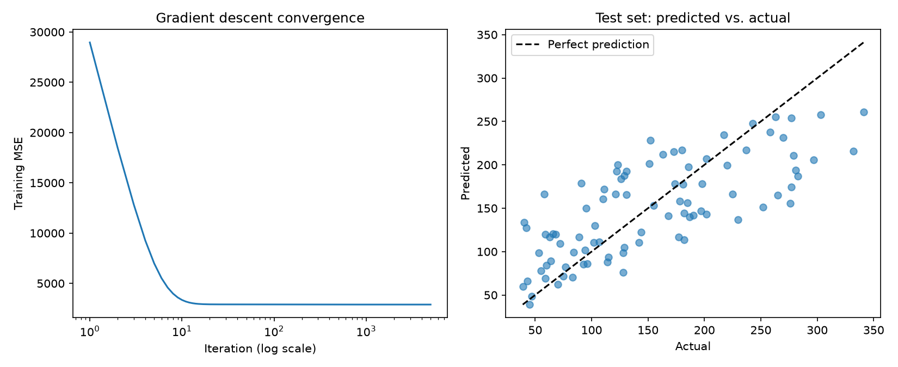

# Linear Regression in NumPy

This project fits an ordinary least squares (OLS) regression in two ways using NumPy: directly solving the normal equation for an exact answer and iteratively using gradient descent. I then compared and validated both methods against scikit-learn's `LinearRegression`.

## Why I built it

One of my passions in mathematics is scientific computing and modeling mathematical concepts using computer science. Instead of simply relying on prebuilt functions, I wanted to understand the advantages and disadvantages in computing a linear regression exactly and iteratively, while improving my understanding of computer science along the way.

## Dataset

- scikit-learn's diabetes dataset: 442 patients, 10 features including age, BMI, sex and blood pressure
- Target: each patient's diabetes progression score one year later
- Split: 80% train (353 rows) / 20% test (89 rows), shuffled with a fixed seed so results are reproducible

## Method

**1. Preprocessing**

First I split the data into training and test sets in an 80-20 split and then standardized the data so that each feature of the data set had mean = 0 and standard deviation of 1. Standardization is key as it makes sure every feature is on the same scale, so gradient descent converges smoothly and the coefficients of different features are directly comparable. I made sure to only use the training set's mean and standard deviation for both sets, so no information from the test data found its way into training.

Another key step in this process was appending a column of 1s to the feature matrix so that the intercept became like any other feature coefficient. This allows every prediction to become the single matrix multiplication `X @ beta`.

**2. Normal equation**

$$ X^T X \beta = X^T y $$

This equation comes from setting the derivative of the squared error to zero for each coefficient to find the smallest error possible. It's because of this that we can solve the system to directly find the least squares coefficients in one step. However instead of solving the system by taking an inverse as would be typical when doing a problem like this by hand, I used `np.linalg.solve` because solving the system directly is faster and more numerically stable than inverting a matrix. (This is due to the fact that small rounding errors can be amplified when inverting a matrix)

**3. Gradient descent**

$$ \beta \leftarrow \beta - \alpha \cdot \frac{2}{n} X^T (X\beta - y) $$

Gradient descent starts with a guess for the coefficients, namely 0s, and computes the gradient which is the direction in which the error increases maximally. Knowing which way the error rises the fastest, the gradient descent method takes a step in the opposite direction to try and lower the error. Repeating this continually lowers the error as the coefficients settle on values that begin to converge towards the minimum error. In this case I chose a learning rate of 0.1 and 5,000 iterations.

## Results

| Method | Test MSE | Test R² | Max coefficient difference vs scikit-learn |
|---|---|---|---|
| Normal equation | 2768.5 | 0.556 | 2.4e-12 |
| Gradient descent | 2768.5 | 0.556 | 3.0e-03 |
| scikit-learn | 2768.5 | 0.556 | (reference) |



A value of 0.556 for R² in this case means that the model explains about 56% of the variation in disease progression across the test set patients as compared to predicting the average for everyone. The normal equation matches scikit-learn up to floating-point rounding, and gradient descent matches to within 0.003.

## What I learned

**When to use the normal equation vs. gradient descent.** 
As a result of the normal equation solving for the weights directly it builds a $p \times p$ matrix $X^T X$ (about $n p^2$ operations) and then solves it (about $p^3$ operations), which requires $p^2$ memory to store that matrix. On the other hand, gradient descent only does two matrix-vector products per iteration, which is about $n p$ operations and no $p \times p$ matrix. In the case of this project where ($p = 11$), the normal equation is both cheaper and more exact than the gradient descent method. However if we expanded this to a model with millions of parameters the $p^3$ cost and $p^2$ memory become impossible, while gradient descent scales much easier. It's this tradeoff in accuracy vs. efficiency that causes things like neural networks to be trained with gradient descent rather than directly solving through the normal equation.

**Despite error converging quickly, coefficients converge slowly.**
Another interesting observation was how quickly the gradient descent's error dropped as compared to how much longer it took the coefficients to settle. The training error quickly dropped from about 30,000 to about 3,000 in only about 10-15 iterations, whereas the coefficients needed thousands of iterations to get close to matching the normal equation. This mainly occurred due to the fact that some features like cholesterol measuring `s1` and `s2` are highly correlated, meaning that many combinations of their weight would give nearly identical errors. Because the valley floor is nearly flat, the gradient there is tiny, so each step barely moves the coefficients even though the error is already close to its minimum. That's why the convergence plot flattens after about 15 iterations while the coefficients keep slowly adjusting.

## How to run

```bash
pip install -r requirements.txt
python linear_regression.py
```

The script prints the coefficients and test results, saves `results.png`, and stops with an error if either method disagrees with scikit-learn.